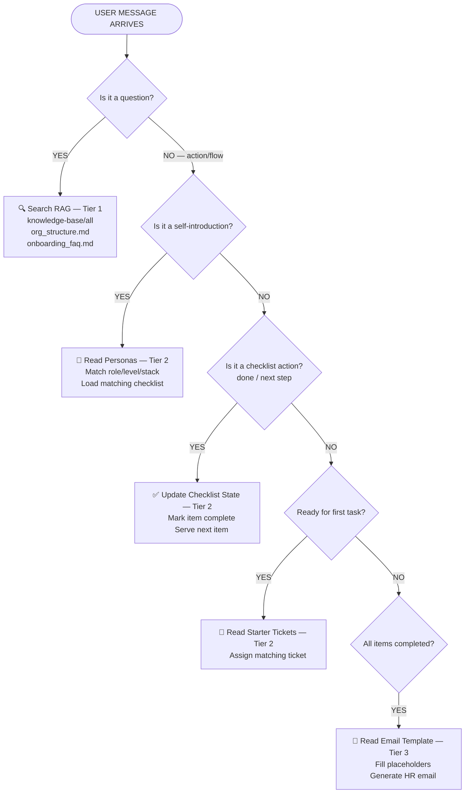

# The Three Access Patterns

Think of it like three tiers:

- **Tier 1 — RAG Ingestion (Always Searchable)**  
  These are chunked, embedded, and stored in a vector DB. The agent retrieves relevant chunks when the user asks questions.

- **Tier 2 — Agent Logic Files (Read On-Demand by Agent, Not User)**  
  The agent reads these at specific trigger points during its workflow — like Claude Skills. The user never queries these directly.

- **Tier 3 — Templates (Read Once at Generation Time)**  
  The agent loads these only when it needs to produce a specific output.

---

# File-by-File Breakdown

### Quick Links

| File                                                             | Description                          |
| ---------------------------------------------------------------- | ------------------------------------ |
| [company_overview.md](./company_overview.md)                     | Company info, products, tech stack   |
| [engineering_standards.md](./engineering_standards.md)           | Coding rules, PR process, API design |
| [architecture_documentation.md](./architecture_documentation.md) | Services & system architecture       |
| [setup_guides.md](./setup_guides.md)                             | Environment setup instructions       |
| [policies.md](./policies.md)                                     | Security, leave, VPN, compliance     |
| [org_structure.md](./org_structure.md)                           | Teams, contacts, channels            |
| [onboarding_faq.md](./onboarding_faq.md)                         | Common onboarding questions          |
| [employee_personas.md](./employee_personas.md)                   | Role-based onboarding personas       |
| [onboarding_checklists.md](./onboarding_checklists.md)           | Step-by-step onboarding checklists   |
| [starter_tickets.md](./starter_tickets.md)                       | First task tickets by role           |
| [email_templates.md](./email_templates.md)                       | HR email templates                   |
| [guidelines.md](./guidelines.md)                                 | PS03 guidelines                      |

---

## 📚 Tier 1 — RAG Ingestion (Vector DB)

These go into your knowledge base because **users will ask questions** about this content.

| File                                                               | Why Ingest                                           | Example User Query                          |
| ------------------------------------------------------------------ | ---------------------------------------------------- | ------------------------------------------- |
| [`company_overview.md`](./company_overview.md)                     | User asks about company, products, tech stack        | "What does NovaByte build?"                 |
| [`engineering_standards.md`](./engineering_standards.md)           | User asks about coding rules, PR process, API design | "What's the branching strategy?"            |
| [`architecture_documentation.md`](./architecture_documentation.md) | User asks about services, how things connect         | "Which service handles notifications?"      |
| [`setup_guides.md`](./setup_guides.md)                             | User asks for help setting up their environment      | "How do I install Python for this project?" |
| [`policies.md`](./policies.md)                                     | User asks about security, leave, VPN, compliance     | "Do I need VPN to access staging?"          |
| [`org_structure.md`](./org_structure.md)                           | User asks about teams, contacts, channels            | "Who do I contact for GitHub access?"       |
| [`onboarding_faq.md`](./onboarding_faq.md)                         | User asks common onboarding questions                | "How many PR approvals do I need?"          |

**Total: 7 files → All in:**

- `knowledge-base/`
- `company-structure/`
- `faq/`

---

## 🧠 Tier 2 — Agent Logic Files (Read by Agent, Not by User)

These are **not for the user to query**.  
The agent reads them internally at specific decision points in its workflow — exactly like Claude Skills.

---

### [`personas/employee_personas.md`](./employee_personas.md)

- **When to read:**  
  Right after the user introduces themselves

  > "Hi, I'm Riya, a Backend Intern working on Node.js"

- **Purpose:**  
  The agent matches the user's input (role, level, stack) against these personas to determine the correct onboarding path.

- **How it works:**
  1. Agent extracts → role, experience level, tech stack
  2. Matches to closest persona
  3. Uses the **"Expected Onboarding Focus"** section to plan the flow

- ❗ **NOT ingested into RAG** — the user should never see or query other employees' profiles

---

### [`checklists/onboarding_checklists.md`](./onboarding_checklists.md)

- **When to read:**  
  After persona is identified

- **Purpose:**  
  Agent loads the _Common Checklist_ + the matching role-specific checklist and guides the user step-by-step.

- **How it works:**
  1. Agent identifies persona → e.g., Backend Intern (Node.js)
  2. Loads **Common Checklist** (C-01 to C-28)
  3. Loads **Backend Intern Checklist** (BI-01 to BI-20)
  4. Merges them into one ordered onboarding plan
  5. Tracks completion as the user progresses

- ❗ **NOT ingested into RAG** — the agent uses this as a structured state machine, not searchable content

---

### [`starter-tickets/starter_tickets.md`](./starter_tickets.md)

- **When to read:**  
  When the user reaches the **"First Task" phase** of onboarding

- **Purpose:**  
  Agent selects and assigns the correct starter ticket based on role.

- **How it works:**
  1. Agent matches role
  2. Selects appropriate ticket
     - Example: `FLOW-INTERN-001` for Backend Intern
  3. Presents it to the user with full context

- ❗ **NOT ingested into RAG** — agent reads this only at a specific workflow step

---

## 📝 Tier 3 — Templates (Read Once at Output Time)

---

### [`hr-templates/email_templates.md`](./email_templates.md)

- **When to read:**  
  Only when the agent is about to generate the HR completion email

- **Purpose:**  
  Agent loads the template and fills placeholder variables using tracked state data (checklist completion, employee info, timestamps).

- **How it works:**
  1. User completes all checklist items
  2. Agent detects → `onboarding_status = COMPLETED`
  3. Agent reads `email_templates.md`
  4. Picks **Template 1 (Completion Report)**
  5. Fills all `{placeholders}` with real data
  6. Sends/displays the structured email

- ❗ **NOT ingested into RAG** — this is a generation template, not knowledge

---

## Visual Summary



---

# In Code Terms

```python
# Tier 1 — Loaded into vector DB at startup
rag.ingest("knowledge-base/*.md")
rag.ingest("company-structure/org_structure.md")
rag.ingest("faq/onboarding_faq.md")


# Tier 2 — Read by agent at specific triggers
def on_user_introduction(user_input):
    personas = read_file("personas/employee_personas.md")  # Skill-like read
    matched = match_persona(user_input, personas)

    checklist = read_file("checklists/onboarding_checklists.md")  # Skill-like read
    plan = build_onboarding_plan(matched, checklist)

    return plan


def on_first_task_phase():
    tickets = read_file("starter-tickets/starter_tickets.md")  # Skill-like read
    return assign_ticket(current_persona, tickets)


# Tier 3 — Read only at generation time
def on_onboarding_complete(state):
    template = read_file("hr-templates/email_templates.md")  # Template read
    email = fill_template(template, state)
    send_email(email)
```
